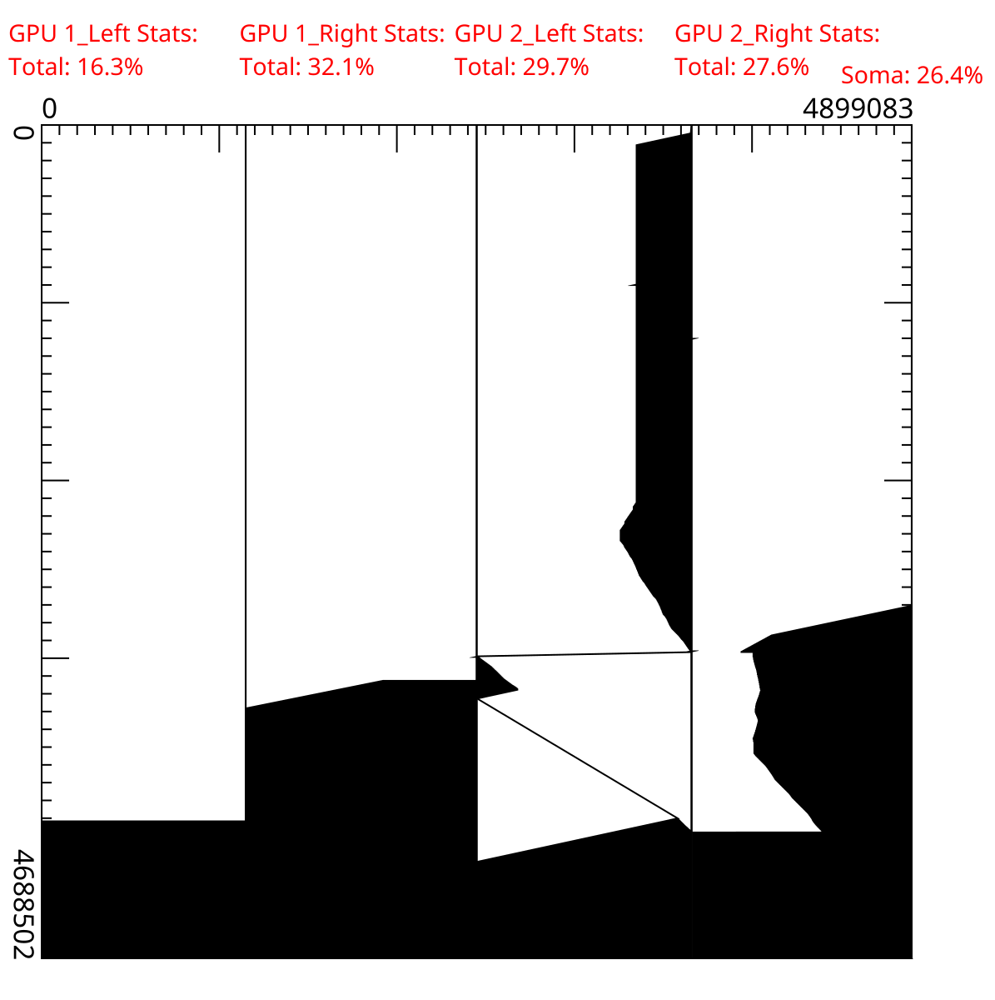

# PlotCUDA

PlotCUDA is a visual tool that permits the visualization of pruned regions in biological sequences alignments, in the multi-GPU platform MultiBP (https://github.com/Marcoacfbr/MultiBP). It uses the CAIRO library to plot the regions pruned by each GPU and presents the respective pruning statistics. This version presents support only for two GPUs.

### Installation

To install this program you can simply clone the repository in the desired machine:
git clone https://github.com/At1l4/PlotCuda.git

### Compilation

The program compilation has to be done with a gcc compatible compiler, and with specific flags for CAIRO:
sudo apt update
sudo apt install libcairo2 libcairo2-dev
g++ -o plotcuda_dyn plotcuda_dyn.cpp $(pkg-config --cflags --libs cairo)

### Compilation

To execute this software, it is necessary to specify all the pruning files, as well as the partial lenghts for the first sequences and the total lenght of the other sequence, which can be found in the statistics files.
./plotcuda_dyn pruning_dump1 pruning_dump2 pruning_dump3 pruning_dump4 len1.1 len1.2 len1.3 len1.4 len2 

### Exemplos de Saída

The resulting image is generated in SVG format. Here we present an example for two 4MB sequences - NZ_CP107553.1 and NZ_CP154406.1 

